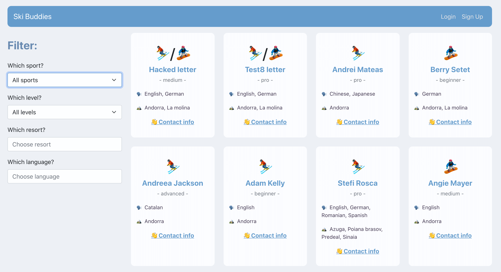

# Ski with me

## What is the goal?

I want to go skiing but most of my friends who ski are in Romania.

I would love to have a directory app where I can can look up people based on a resort and message them to pair up for a ski day, so I am building it ⛷

> **Main goal:** connect skiers/snowboarders with each other so they can go ski/snowboard together.



## How to install it and get started

Create a database named skiBuddies locally.

```
git clone https://github.com/stefi23/ski-with-me
$ cd ski-with-me
$ npm run migrate
$ npm start
```

Open another terminal window:

```
$ cd ski-with-me
$ cd client
$ npm start
```

## When? (Situation)

When you want to go skiing/snowboarding in a specific place but none of your friends cand join you or you are new in a town with no skier/boarder friends and would like some company.

You then go to this database and look for buddies. In a way it's an app for ski/snowboard hangouts.

## So I can? (Expected outcome)

Fomd someone or more people to go skiing/snowboarding with.

---

## What info will be needed in the profiles?

- Name
- Ski / Snowboard / Both
- Level: Beginner, Mid, Advance, Freelance, Pro, Offpist.
- About (short description)
- Contact info: Email
- Contact info: Phone (optional)
- Location: add resort that are around you
- Langages spoken

## Search functionality:

Search based on:

- Resort
  Filter by:
- Ski/Snowboard/Both
- Level
- Language

## Nice to have:

Add an option to mark as favorite people you'd like to go ski/snowboard with.

Would like to have something similar to [Coding Coach](https://mentors.codingcoach.io/)
